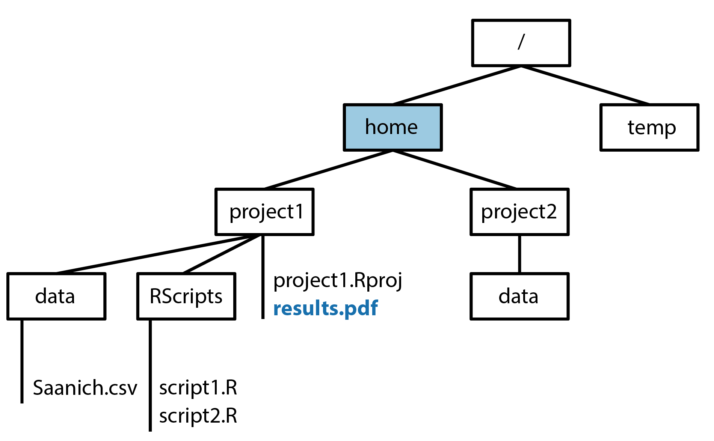

# Unix navigation practice
These problems are designed to help you practice concepts and functions covered in the 'Unix navigation tutorial'.

## Learning objectives

* Define parts of the terminal
* Use Unix commands to navigate your computer including pwd, ls, man/help, and cd

## Practice

1. Match the following Unix commands with their associated functions. Each option will only be used once.
    - List all contents of the current directory
    - Print the current directory
    - Change directory 
    - The home shortcut
    - End a terminal session 
 
    - cd
    - ls
    - exit
    - ~
    - pwd
    
2. In a terminal window, what command could you use to open the help page for the ls function? How many different option parameters are available for the ls function?

*The remaining questions refer to following file structure. Directories are enclosed in boxes and files are listed under their associated directory. The home directory is highlighted in blue.*

{width=100%}
\ 

3. What is the full file path of the file highlighted in blue? Several may apply.
  - /home/project1/results.pdf 
  - ~/results.pdf 
  - /project1/results.pdf 
  - /home/project1/project1.Rproj/results.pdf 
  - ~/project1/results.pdf 

4. If you terminal is currently pointing to the project1/RScripts directory, how would you navigate to the home directory? Several may apply.
  - cd ~ 
  - cd ../.. 
  - cd .. 
  - cd home 
 
5. If your terminal is currently pointing to the home directory and you begin a command to move into the project2 directory with

cd proj

Coule a single tab-completion can be used to complete the command correctly?

***