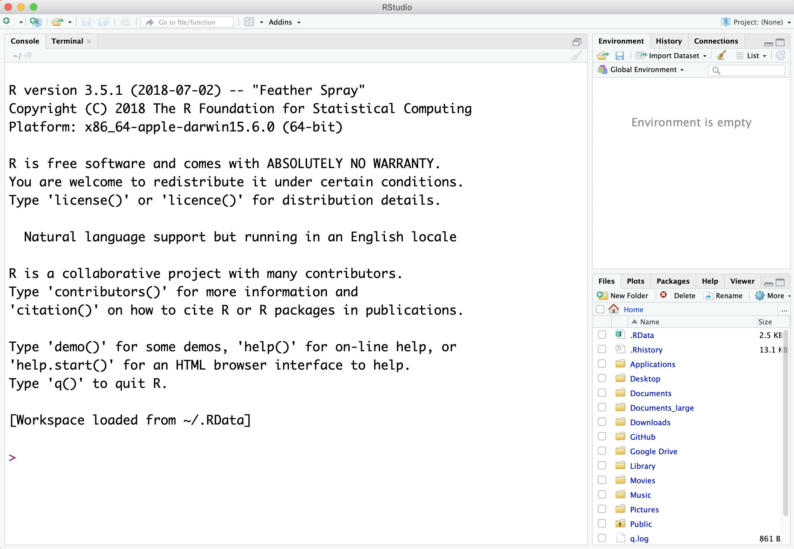

# Download instructions for R/RStudio
Please download and install the following software in order to complete data science modules in R.

1. R http://cran.stat.sfu.ca/
    - Install the latest version if available for your operating system.
    - If you are using *Mac Yosemite* (OS X 10.10) or older, you will only be able to upgrade to v3.3
2. RStudio https://www.rstudio.com/products/rstudio/download/
    - FREE version
    - Under the 'Installers' section, not 'Zip/Tarballs/'
3. Check that it worked by opening RStudio. You should see a multi-panel program like below with you R version listed at the top of the Console panel on the left. 

## Troubleshooting R/RStudio

1. **My computer won't let me open the downloaded files to install them.**
    - Mac: right-click and choose ‘Open With’ --> ‘Installer.app (default)’ and choose ‘Open’ when prompted if you are sure you want to open the file
    - Windows: right-click and choose ‘Run as administrator’

2. **RStudio looks incorrect.**
    - If you only see a single panel instead of 3 like in the example image, you likely opened base R instead of RStudio. Look for the RStudio symbol {width=3%} to open the correct program.

\vspace{24pt}

```{r echo=FALSE, out.width = "300px", fig.align="center"}

```

Figure 1. RStudio

***