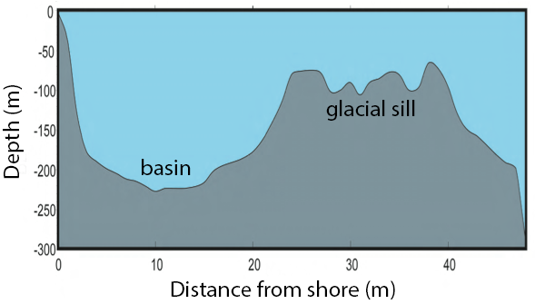

## Saanich Inlet
The data used in EDUCE modules were collected as part of an on-going oceanographic time series in Saanich Inlet, a seasonally anoxic fjord of the East coast of Vancouver Island, British Columbia. Since 2006, samples have been collected approximately monthly for nine sampling sites throughout the inlet (Figure 1). EDUCE modules focus on the S3 site, where consistent geochemical and microbial data were collected from 2008 to 2014. 

 

{width=4in}
{width=5in}

**Figure 1.** Saanich Inlet (left) Map indicating conventional sample collection stations (S1-S9). (right) Structure at the mouth of the inlet where a glacial sill  restricts water circulation into and out of the lower depths of the inlet basin.

 

Saanich Inlet is a steep-sided fjord characterized by a shallow glacial sill at its mouth (Figure 1) restricting circulation in basin waters below 100 m. During spring and summer months, elevated primary production (like photosynthesis) in surface waters combined with restricted circulation results in progressive water column stratification and complete oxygen starvation (anoxia) in deep basin waters. In late summer, pulses of oxygenated, nutrient-rich ocean waters upwelling from the Haro Straight cascade over the sill, displacing oxygen-starved bottom waters upward. The intensity of these renewal events varies from year to year, with implications for microbial ecology and biogeochemical cycles (Figure 2).

 

**Figure 2.** Contour plot of water column oxygen concentrations over multiple years in the time series. Warmer colors indicate high oxygen concentrations while cooler colors are low. Note the recurring pattern of oxygen decline below 100 m depth intervals followed by seasonal renewal events in late Summer into early Fall carrying more oxygenated waters into the Inlet.

 

The seasonal cycle of stratification and deep water renewal enables spatial and temporal profiling across a wide range of water column energy states and nutrients, thus making Saanich Inlet a model ecosystem for studying microbial community responses to ocean deoxygenation. Ocean deoxygenation is a widespread phenomenon currently increasing due to climate change. 

For a brief introduction to the data, see Hallam SJ *et al*. 2017. Monitoring microbial responses to ocean deoxygenation in a model oxygen minimum zone. Sci Data 4: 170158 [doi:10.1038/sdata.2017.158](https://www.nature.com/articles/sdata2017158) More detailed information on the geochmeical data can be found in Torres-Beltrán M *et al*. 2017. A compendium of geochemical information from the Saanich Inlet water column. Sci Data 4: 170159. [doi:10.1038/sdata.2017.159](https://www.nature.com/articles/sdata2017159) More detailed information on the mutli-omic microbial data can be found in Hawley AK *et al*. 2017. A compendium of multi-omic sequence information from the Saanich Inlet water column. Sci Data 4: 170160. [doi:10.1038/sdata.2017.160](https://www.nature.com/articles/sdata2017160)