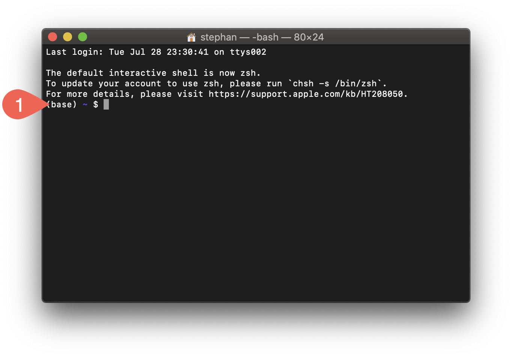

Miniconda is a minimal installer for Conda, Python, their dependencies and a small collection of packages. Conda itself fulfills two functions:

1) Conda is a package manager, i.e. think of it as an App Store where you can get apps for your command-line interface (CLI). These apps are downloaded as so-called packages.

1) Conda acts as an environment manager. One of the difficulties when working with software tools is that these often have dependencies, i.e. need other programs to properly function (which might themselves need other programs and so on). Unfortunately, some programs might, at the same time, conflict with other programs or only work with specific version numbers. It is often difficult to have one universal install in which all of your tools will work predictably at the same time. Instead, an environment manager enables you to configure independent environments, i.e. a set of programs (each also with a defined version) in which one tool or combination of tools works. 

The installation instructions below assume that you have already set up [`bash`](bash.html) on macOS or Linux systems or, if you are on a Windows machine, installed the Windows Subsystem for Linux (WSL).

## {.tabset .tabset-fade .tabset-pills}

### Linux/WSL

- In your Terminal (on Windows, switch to WSL), download the Miniconda installer

  ```{bash eval = FALSE}
  curl -sL \
    "https://repo.anaconda.com/miniconda/Miniconda3-latest-Linux-x86_64.sh" > \
    "Miniconda3.sh"
  ```
  
### macOS

- In your Terminal download the Miniconda installer

  ```{bash eval = FALSE}
  curl -sL \
    "https://repo.anaconda.com/miniconda/Miniconda3-latest-MacOSX-x86_64.sh" > \
    "Miniconda3.sh"
  ```

## 

- Install Miniconda by entering:
  
  ```{bash eval = FALSE}
  bash Miniconda3.sh
  ```
  
  and follow the prompts, accepting all defaults.
  
- Restart your Terminal. Now your prompt should list which environment is active {width=3%} (in this case "base", i.e. the default).

  {width=50%}

- Update Conda using the command:

  ```{bash eval = FALSE}
  conda update conda
  ```

- After installation, delete the installer:
  
  ```{bash eval = FALSE}
  rm Miniconda3.sh
  ```

- Finally, install the program `wget` using Conda to download any files using CLI:

  ```{bash eval = FALSE}
  conda install wget
  ```
  
## Resources

- [Conda documentation](https://docs.conda.io/en/latest/)
- [Installers with instructions for Miniconda](https://docs.conda.io/en/latest/miniconda.html)