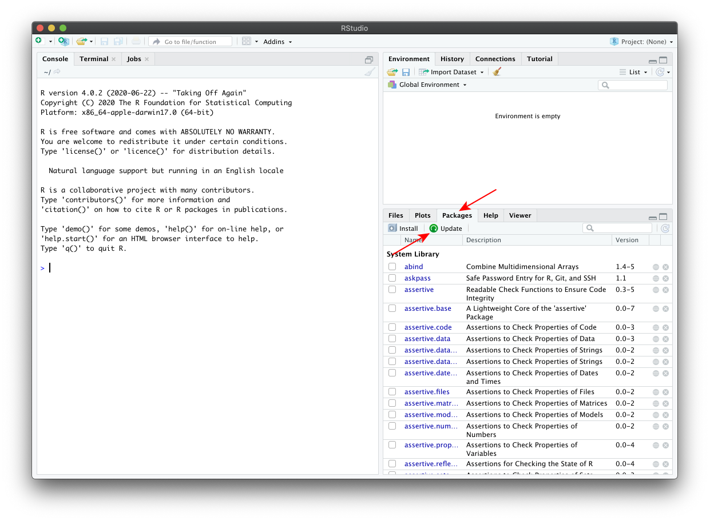

## Installing and updating packages in RStudio

- Install the devtools packages by copying the following code into the left panel (the "console") of RStudio {width=3%} (the code will determine if it is not yet installed):

  ```{r install-devtools, eval = FALSE}
  if (!require(devtools)) install.packages("devtools")
  ```

- Install the educer package by entering the following code into the console {width=3%}:
    
  ```{r install-educer, eval = FALSE}
  devtools::install_github("EDUCE-UBC/educer")
  ```

- Update packages by selecting the "Packages" tab of the bottom right panel {width=3%} and then click on "Update" {width=3%}.

- If any packages are listed, first click on "Select All" {width=3%} and then "Install Updates" {width=3%}.
      
- While updating your packages you might be asked
    
  ```
  Do you want to install from sources the package which needs compilation? (Yes/no/cancel)
  ```
  in the console. Type `no` and hit enter.
