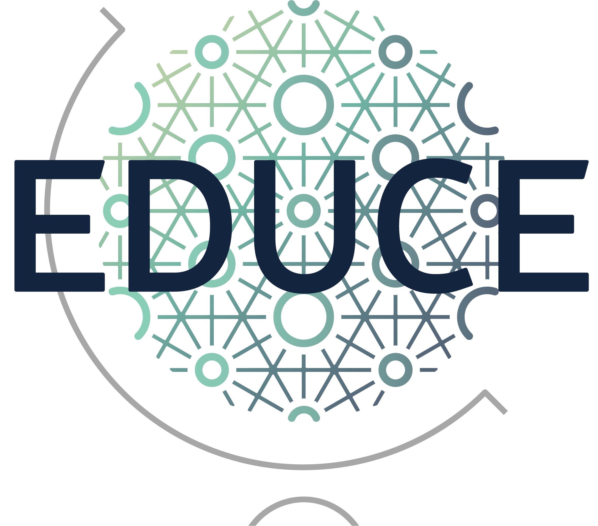

 

  
Experiential Data science for Undergraduate Cross-disciplinary Education 

  
Part of ECOSCOPE at the University of British Columbia

  
Vancouver, BC, Canada

  

  <b>Contact<b/>
  

  

  
EDUCE Program

  
GitHub: https://github.com/EDUCE-UBC

  
Website: https://educe-ubc.github.io

  
Email: info.ecoscope@ubc.ca

  

  

  
ECOSCOPE Program

  
Twitter: https://twitter.com/ecoscope_ubc

  
Website: http://ecoscope.ubc.ca/

  
Email: info.ecoscope@ubc.ca

  

      

