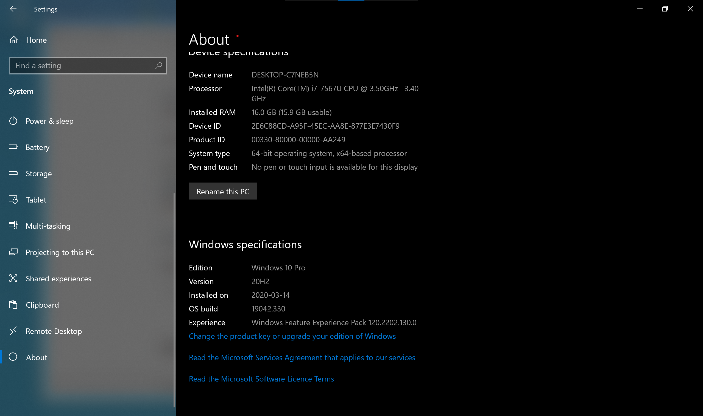
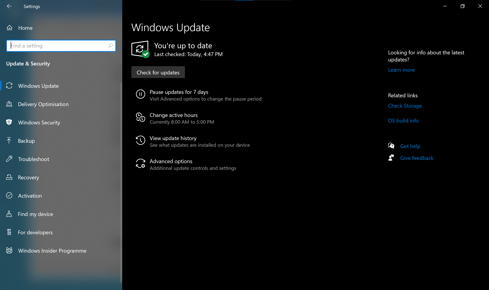

## Disclaimer

**If you update or upgrade your operating system (OS) you do so on your own risk!**

In general, there are many good reasons to update your OS. Some of the software tools or their functionality used in our tutorials will only work on more recent OS versions. Updating your OS will also ensure that you have the latest security updates installed and help prevent unauthorized access to your computer.

There a two main reasons that would prevent you from updating your OS:

1) Your hardware would not support the updated OS.
2) Some of your software you depend on might not work on a newer OS.

## {.tabset .tabset-fade .tabset-pills}

### Windows 10 {#windows}

Please update to the latest version of Windows 10: version `r params$windows_version`.
(Major Windows versions indicate in which half of the year they were released, i.e. the latest version `r params$windows_version` in `r params$windows_version_release_date`.)

- Check your current Windows version {width=3%}: Select the Windows Start button > Settings > System > About > scroll to bottom of page

  {width=75%}

- If you do not have the latest version installed: Select the Windows Start button > Settings > Update & Security > Windows Update

  {width=75%}

- If Windows Update does not offer the latest version, then manually update by going to [Windows 10 Downloads](https://www.microsoft.com/software-download/windows10) and choosing the latest version.

#### Resources

- [Which version of Windows operating system am I running?](https://support.microsoft.com/en-ca/help/13443/windows-which-version-am-i-running)
- [Update Windows 10](https://support.microsoft.com/en-ca/help/4027667/windows-10-update)

### macOS

Please upgrade to the latest version of macOS, `r params$macos_version`.

Check your [current version of macOS](https://support.apple.com/en-ca/HT201260). If you do not have the latest version, follow the upgrade instructions on the [Apple support page](`r params$macos_version_link`).

If you cannot upgrade to the latest version, follow [these instructions](https://support.apple.com/en-us/HT211683) to find the system requirements and upgrade to latest versions available to you. If you need to maintain [32-bit compatibility](https://support.apple.com/en-us/HT208436) for any of your software, then upgrade to no higher than macOS 10.14 Mojave.

#### Resources

- [Find out which macOS your Mac is using](https://support.apple.com/en-ca/HT201260)
- [How to upgrade to macOS Big Sur](https://support.apple.com/en-us/HT201475)
- [How to get old versions of macOS](https://support.apple.com/en-us/HT211683)
- [32-bit app compatibility with macOS High Sierra 10.13.4 and later](https://support.apple.com/en-us/HT208436)