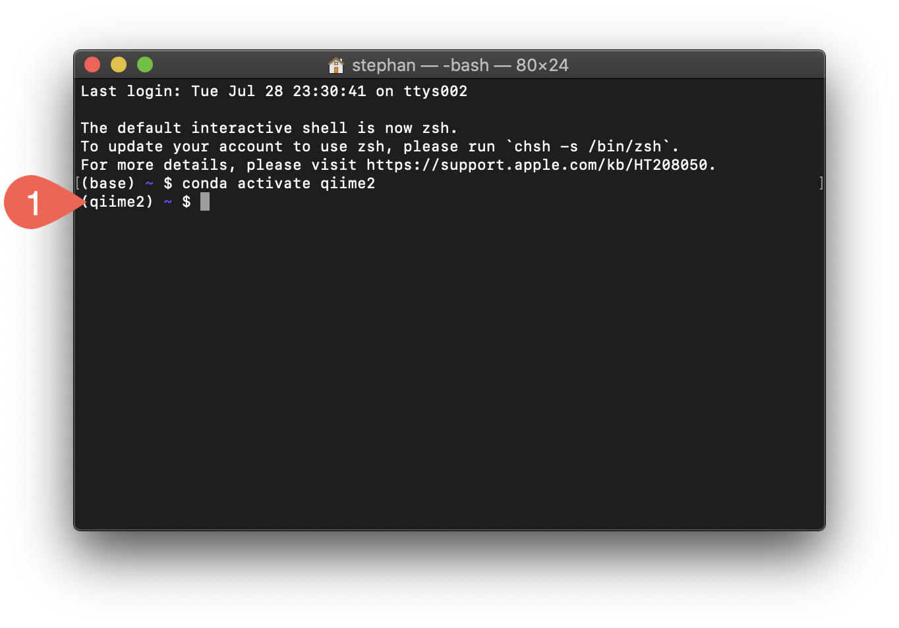

QIIME 2 is a microbiome bioinformatics platform to analyze amplicon sequence data. The installation instructions below assume that you have already installed [Miniconda](condta.html).

- In your Terminal (on Windows, switch to WSL), download the configuration file for a Conda environment that also contains QIIME 2

  for Linux/WSL:
  
  ```{bash eval = FALSE}
  curl -sL \
    "https://data.qiime2.org/distro/core/qiime2-2020.8-py36-linux-conda.yml" > \
    "qiime2.yml"
  ```
  
  for macOS:
  
  ```{bash eval = FALSE}
  curl -sL \
    "https://data.qiime2.org/distro/core/qiime2-2020.8-py36-osx-conda.yml" > \
    "qiime2.yml"
  ```

- Create a new Conda environment (this also installs QIIME 2):

  ```{bash eval = FALSE}
  conda env create -n qiime2 --file qiime2.yml
  ```
  
- Delete the environment configuration file:

  ```{bash eval = FALSE}
  rm qiime2.yml
  ```

- Activate the new Conda environment we have created:

  ```{bash eval = FALSE}
  conda activate qiime2
  ```
  
  Your command prompt should now list `(qiime2)` as your Conda environment {width=3%}.
  
  {width=50%}
  
- Test that QIIME 2 is installed:

  ```{bash eval = FALSE}
  qiime info
  ```

## Resources

- [QIIME2 documentation](https://docs.qiime2.org/2020.6/)
- [QIIME2 native installation instructions](https://docs.qiime2.org/2020.6/install/native/)

