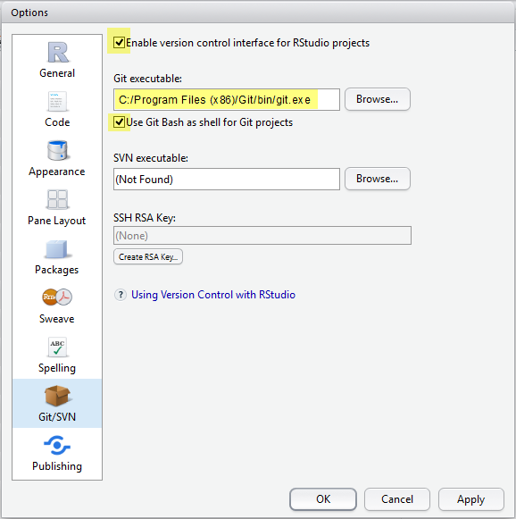
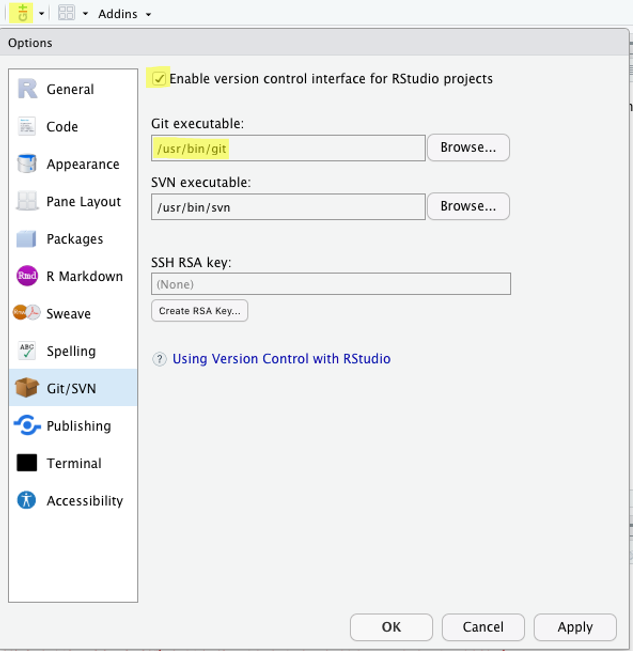

## Instructions for all users

1. Make sure that you have installed the [latest versions of R and RStudio](r_and_rstudio.html). 
2. Install the tidyverse and the renv packages by copying the following code into the Console, after the prompt `>`

  ```{r install-tidyverse, eval = FALSE}
  if (!require(tidyverse)) install.packages("tidyverse")
  if (!require(renv)) install.packages("renv")
  ```

3. Download the data file we will use during the workshop by clicking on the following button and save it in your Desktop or another convenient location.
  
```{r echo = FALSE}
data_file <- read.csv("https://raw.githubusercontent.com/EDUCE-UBC/educer/main/data-raw/data_intro_ws.csv")

downloadthis::download_this(data_file,
    output_name = "data",
    output_extension = ".csv",
    button_label = "Download data",
    button_type = "default",
    has_icon = TRUE,
    icon = "fa fa-save",
    class = "hvr-sweep-to-left",
    csv2 = FALSE
  )
```

## Instructions for Windows users

### Terminal

Install [GitBash](https://gitforwindows.org/), which emulates Bash (a Unix shell) in Windows. All command-line instructions should be completed in GitBash and not the native Windows Command Prompt.

### Git

1. Basic Git was installed automatically with your GitBash Terminal.
2. Test that Git is properly installed by opening GitBash and typing `git --version` [Enter]. This should populate the window with information on your version of Git such as

```
git version 2.20.1.windows.1
```
 
3. Once you've installed Git, you'll need to activate it in RStudio:
    - Open RStudio and go to Tools > Global Options > Git/SVN
    - Click "Enable version control interface for RStudio projects"
    - If necessary, enter the path for your Git executable where provided.
        - The path should look approximately like `C:/Program Files/Git/bin/git.exe`
        - Warning: do **not** use `C:/Program Files/Git/cmd/git.exe`. The path should include `bin`, **not** `cmd`.
        - Warning: the path should end in `git.exe`, **not** in `git-bash.exe`
    - Restart RStudio.
  


4. Finally, you need to change your environment variables to ensure you can run R scripts from GitBash:
    - Open the Control Panel > System Properties > Advanced. In Windows 10 you can find this by searching for "environment".
    - Click on the "Environment Variables..." button to open the settings for the environment variables.
    - In the window that pops up select the `PATH` variable and click the "Edit" button below it.
    - In the next window that pops up click the "Browse" button and navigate to the folder that contains the `Rscript.exe` file. The path should look approximately like `C:/Program Files/R/R-4.0.3/bin/Rscript.exe`.
    - Test that everything worked by restarting GitBash and typing `Rscript --version` [Enter]. This should populate the window with information information on your version of R such as

```
R scripting front-end version `r params$r_version`
```
 

### GitHub

1. If you do not already have one, sign up for an account on [GitHub](https://github.com/).
2. Configure your GitHub user name and email (the email address you used to register on GitHub). To do this, open GitBash and type:

```
git config --global user.name '<your GitHub username>'
git config --global user.email '<name@provider.com>'
```

### Make

1. Download the [Make *without guile* (version `r params$make_version`)](https://sourceforge.net/projects/ezwinports/files/), file name `` `r paste0("make-", params$make_version, "-without-guile-w32-bin.zip")` ``.
2. Unzip the folder.
3. Copy all of its contents to `C:\Program Files\Git\mingw64\`.
  - Merge all of the contents of the folders but do NOT overwrite/replace any existing files.
4. Check that Make is installed by typing `make --version` [Enter] in GitBash. This should populate the window with information on your version of Make such as

```
GNU Make `r params$make_version`.
Built for Windows32
Copyright (C) 1988-2016 Free Software Foundation, Inc.
License GPLv3+: GNU GPL verison 3 or later <http://gnu.org/licenses/gpl.html>
This is free software: you are free to change and redistribute it.
There is NO WARRANTY, to the extent permitted by law.
```

## Instructions for Mac users

### Terminal

The native Terminal on macOS is Unix-based and, therefore, can be used in this workshop. You can access it under Applications > Utilities > Terminal.app

### Git

1. Download and [install Git](https://git-scm.com/downloads). 
2. Test that Git is properly installed by opening your Terminal and typing `git --version` [Enter]. This should populate the window with information on your version of Git such as

```
git version 2.18.0
```

3. Once you've installed Git, you'll need to activate it in RStudio:
  - Open RStudio and go to Tools > Global Options > Git/SVN
  - Click "Enable version control interface for RStudio projects"
  - If necessary, enter the path for your Git executable where provided (see picture below).
  - Restart RStudio.



### GitHub

1. If you do not already have one, sign up for an account on [GitHub](https://github.com/).
2. Configure your GitHub user name and email (the email address you used to register on GitHub). To do this, open the Terminal and type:

```
git config --global user.name '<your GitHub username>'
git config --global user.email '<name@provider.com>'
```

### Make

1. Download and install the Mac command line developer tools (including Make) by opening your Terminal and typing: `xcode-select --install` [Enter]. In the window that opens, click "Install" to allow the installation of the full developer’s packet.
2. Check that Make is installed by typing `make --version` [Enter] in your Terminal. This should populate the window with information on your version of Make such as

```
GNU Make `r params$make_version`.
Copyright (C) 2006  Free Software Foundation, Inc.
This is free software; see the source for copying conditions.
There is NO warranty; not even for MERCHANTABILITY or FITNESS FOR A
PARTICULAR PURPOSE.

This program built for i386-apple-darwin11.3.0
```
