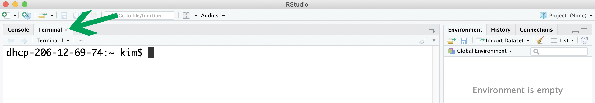

# Download instructions for Unix terminal
## Mac or Linux
Your opertating system comes with a pre-installed Unix command line program that you can find by searching 'terminal' in you file explorer/finder.

## Windows
The pre-installed command line program for Windows, the command prompt, is not Unix based. Thus, you will need to install a separate program. Some recommended options are [Git Bash](https://git-for-windows.github.io) or [PuTTY](https://www.chiark.greenend.org.uk/~sgtatham/putty/latest.html).

## RStudio option
Another terminal option is available within RStudio, which you may already have installed for other data science modules. On the left side, there is a second tab 'Terminal'. If this tab is not currently available, it can be opened under Tools -> Terminal -> Move Focus to Terminal.

### Example terminal programs

```{r echo=FALSE, out.width = "230px"}
knitr::include_graphics("images/terminal_mac.png")
knitr::include_graphics("images/terminal_windows.png")
```

Figure 1. Mac (left) and GitBash (right) terminals

\vspace{24pt}

```{r echo=FALSE, out.width = "460px"}

```

Figure 2. RStudio terminal

***