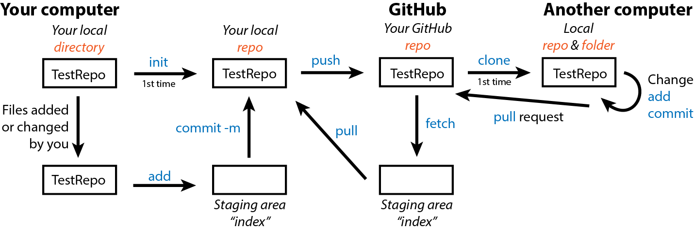
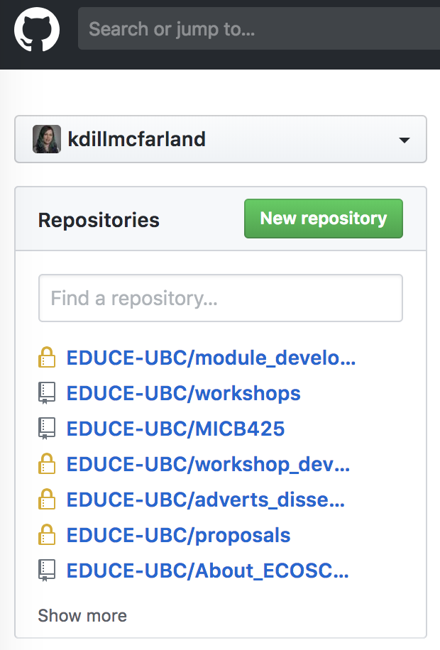
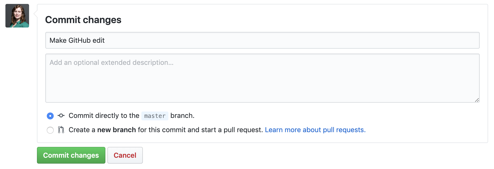
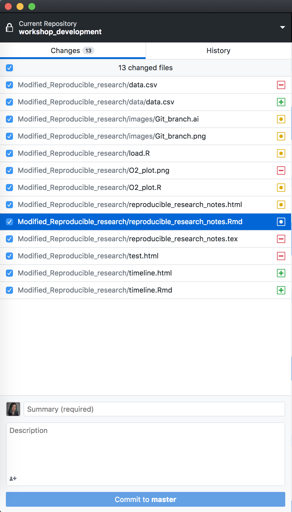
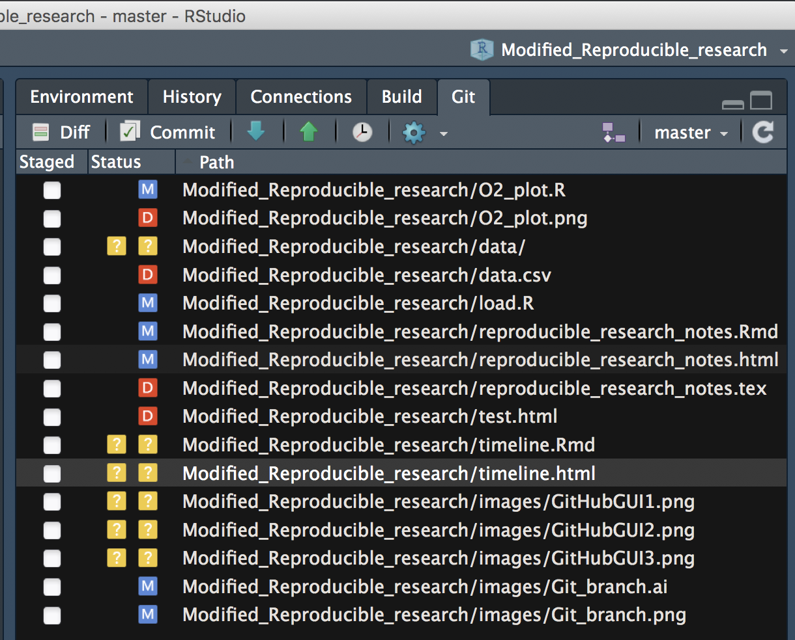

# Version control with GitHub tutorial
## Learning objectives

* Practice Unix command line
* Share and modify a version controlled file using GitHub

## Setup
If you would like to follow along:

1. Download the [Git](https://git-scm.com/downloads) installer for your operating system
    - If you are using the GitBash terminal, you already have git installed
2. Run the installer and follow prompts
3. Check that git is installed by opening your terminal and inputting `git`[Enter]
    - You should see a help page starting with
    ```
    usage: git [--version] [--help] [-C <path>] [-c <name>=<value>]
           [--exec-path[=<path>]] [--html-path] [--man-path] [--info-path]
           [-p | --paginate | -P | --no-pager] [--no-replace-objects] [--bare]
           [--git-dir=<path>] [--work-tree=<path>] [--namespace=<name>]
           <command> [<args>]
    ```
    - You may need to restart your computer to fully install
    - If you do not have a Unix terminal, see the 'Download_Unix_terminal' instructions.
4. Go to [GitHub](https://github.com/) and create a free account.

## Why GitHub?
[GitHub](https://github.com/) is a web service for hosting Git repositories - content and version history. It has web and GUI interfaces as well as many tools for facilitating collaboration within repos. 

While you can setup version control on your personal computer without linking to [GitHub](https://github.com/), as seen in the 'Git tutorial', many of the benefits of Git are only fully realized through its interactions with GitHub. We will demonstrate some of these benefits here.

## Using GitHub
Please use the follow schematic to help you orient yourself throughout this tutorial.


\ 

### Configure GitHub on your computer
Before we begin, we need to link your computer to your online GitHub account. This only needs to be done once on your computer.

Open a new terminal window and set your git account user name and email.

```{bash eval=FALSE}
git config --global user.name "Your Name"

git config --global user.email "youremail@email.com"
```

*This needs to be the same email that you used to set up your GitHub account.*

### Make an online repo
Next we will make an online GitHub repo to link our local repo to. In a browser, navigate to your [GitHub](https://github.com/) account homepage and click "New repository".

{width=50%}
\ 

Name the repo `TestRepo` and create it. GitHub then gives you the URL for this repo. 


\ 

### Link local and online repo (`git remote`)
Finally, we will link our TestRepo to the online GitHub repo using the URL provided. If you completed the 'Version control with Git tutorial', you can use the TestRepo created there. Otherwise, please create and `init` a new directory on your computer where you would like this repo to be.

```{bash echo=FALSE, eval=FALSE}
#Repeat Git tutoral to setup repo
mkdir Desktop/TestRepo
cd Desktop/TestRepo

# Create readme
echo -e 'Hello!\nMy birthday is November 29.\nMy favorite color is purple.\nI like cats.\nI like dogs too!' > README.md

# Initialize repo, add all files, commit changes
git init
git add .
git commit -m "Init repo"
```

In either case, you link the directory on your computer (local) to the repo on GitHub using *your specific repo URL* in the following command in your terminal. Make sure your terminal is still pointing at the correct directory!

```{bash eval=FALSE}
git remote add origin https://github.com/kdillmcfarland/TestRepo.git
```

### Update an online repo from local (`git push`)
If no errors occur, you can now upload your local repo (with the README file) to GitHub with `push`. The first time you push, you need to specify to GitHub that you are pushing to the main branch of the repo.

```{bash eval=FALSE}
git push -u origin main
```
```
Enumerating objects: 3, done.
Counting objects: 100% (3/3), done.
Delta compression using up to 4 threads.
Compressing objects: 100% (2/2), done.
Writing objects: 100% (3/3), 303 bytes | 303.00 KiB/s, done.
Total 3 (delta 0), reused 0 (delta 0)
To https://github.com/kdillmcfarland/TestRepo.git
* [new branch]      main -> main
Branch 'main' set up to track remote branch 'main' from 'origin'.
```

All subsequent push commands for this repo can simply be

```{bash eval=FALSE}
git push
```

If you go back to your browser and refresh your page, you should now see `README.md` in your online repo.

Once your local repo is fully linked with its online GitHub repo, you can go about version control as you normally would (change files > add > commit). When you have a committed version of the repo that you want to backup or share to GitHub, you `git push`.

### Update a local repo from online (`git fetch` and `pull`)
When you have multiple copies of a repo potentially being worked on and `push`ed to GitHub from multiple computers or people, the version on GitHub may be more up-to-date than the one you have on the computer you happen to currently be working on.

To demonstrate this, go to your GitHub TestRepo and open the README.md. Edit it using the online system indicated by the pencil icon.


\ 

Then add/commit the change using the online tool at the bottom of the page


\ 

Despite this change on GitHub, if you go to your terminal on your computer, you see no changes.

```{bash eval=FALSE}
git status
```
```
On branch main
nothing to commit, working tree clean
```

This is because you must go through a staging area (index) similar to the one in-between your local directory and repo before updating your local repo from GitHub. You can place GitHub content in this index with

```{bash eval=FALSE}
git fetch
```
```
remote: Enumerating objects: 5, done.
remote: Counting objects: 100% (5/5), done.
remote: Compressing objects: 100% (2/2), done.
remote: Total 3 (delta 1), reused 0 (delta 0), pack-reused 0
Unpacking objects: 100% (3/3), done.
From https://github.com/kdillmcfarland/TestRepo
  cdca881..b95f3a9  main     -> origin/main
```

Now, you can see that the branch on your computer is 1 commit behind the branch on GitHub.

```{bash eval=FALSE}
git status
```
```
On branch main
Your branch is behind 'origin/main' by 1 commit, and can be fast-forwarded.
 (use "git pull" to update your local branch)

nothing to commit, working tree clean
```

Finally, if you decide you want to update your local version from GitHub, you reverse push with

```{bash eval=FALSE}
git pull
```
```
Updating cdca881..b95f3a9
Fast-forward
README.md | 1 +
1 file changed, 1 insertion(+)
```

Everything is now up to date

```{bash eval=FALSE}
git status
```
```
On branch main
nothing to commit, working tree clean
```

And you can see both your local and GitHub histories associated with this one repo.

```{bash eval=FALSE}
git log
```
```
commit b95f3a95ffbc8dae2e15608d064b552483c810af (HEAD -> main, origin/main)
Author: Kimberly Dill-McFarland <21342185+kdillmcfarland@users.noreply.github.com>
Date:   Tue Apr 2 21:07:50 2019 -0700

   Make GitHub edit

commit cdca8814a5782e4f19a94be72d3969ef3bec7504
Author: Kim Dill-McFarland <kdillmcfarland@gmail.com>
Date:   Tue Apr 2 21:06:21 2019 -0700

   Init repo
```

### Copy an online repo (`git clone`)
If you are the only one working on your repo and only work on it from 1 computer, then GitHub acts as a one-way street. You push things there for storage and should only need to pull them back down if you change computers or something terrible happens to your local copy.

However, GitHub also allows work on a repo from multiple computers and by multiple different users. Thus, you may wish to copy a repo from GitHub instead of starting a new one from a directory on your computer.

You or others can copy any public online GitHub repo to your computer with 

```{bash eval=FALSE}
git clone URL.of.the.repo
```

For example, you could clone all of the data files used in EDUCE using

```{bash eval=FALSE}
git clone https://github.com/EDUCE-UBC/workshops_access/
```
```
Cloning into 'workshops_access'...
remote: Enumerating objects: 32, done.
remote: Counting objects: 100% (32/32), done.
remote: Compressing objects: 100% (28/28), done.
remote: Total 51 (delta 11), reused 20 (delta 4), pack-reused 19
Unpacking objects: 100% (51/51), done.
```

This, however, does not give you the ability to alter, or `push` to, this repo if you are not the owner on GitHub. This would require additional functions like forks and pull requests. To learn more about how to collaborate on GitHub, see [this GitHub help page](https://help.github.com/en/categories/collaborating-with-issues-and-pull-requests).

## GitHub GUI
After all this command line work, we now reveal to you that you can use Git in [GUI form](https://desktop.github.com/). While the GUI is useful for simple `commit, push, pull` activities, some functions (like hard resets, undos, etc.) are still only available via command line. We encourage you to explore both the command line and GUI forms of Git as you practice.

You can explore all the repos on your computer,

{width=50%}
\ 

see specific changes to text based files,


\ 

and add, commit, push from the GUI.

{width=50%}
\ 

## Git in RStudio
Working in an R project in a directory that is also a Git repo will reveal a Git tab in the upper right quadrant of RStudio.

To see this feature, open RStudio and create an R Project in your TestRepo directory. There  should be a Git tab in the upper right quadrant where you can see `diff` and `commit` changes directly from RStudio as well as see a summary (M: modify, D: delete, ?: add) of changes in the project since your last commit. (You may need to close and reopen RStudio for the Git tab to appear.)

{width=75%}
\ 

***