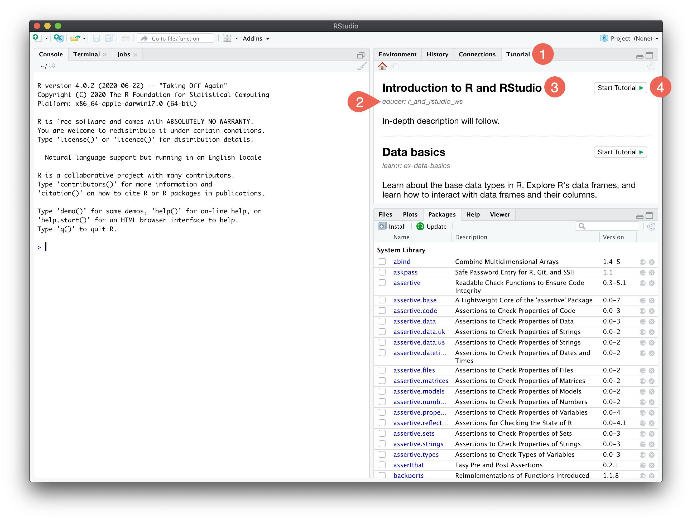
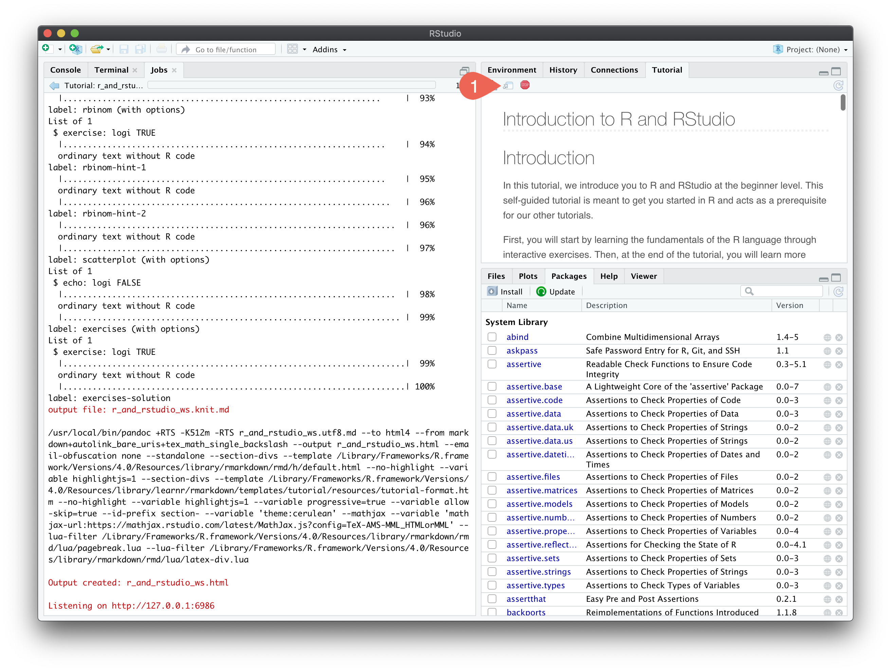

The educer package comes with a number of interactive tutorials. First, make sure that you have installed the [latest versions of R and RStudio](r_and_rstudio.html) as well as the [educer package](educer.html).

## Starting tutorials

Choose the "Tutorial" tab of the top right panel {width=3%} (this tab is only available in the [latest version of RStudio](r_and_rstudio.html)). You will see a scrollable list of all tutorials provided by different packages. Tutorials included in the educer package list "educer" as part of the subheading {width=3%}. Start the tutorial with the title {width=3%} you are looking for by clicking on the corresponding "Start Tutorial" button {width=3%}.

When the tutorial is running, click on the "Show in new window" button {width=3%} to enlarge the window.

